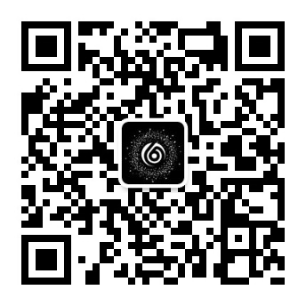
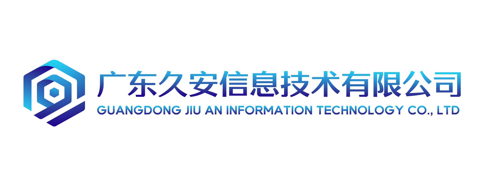

# About Me

- 👋 Hi, My ID is [NGC660安全实验室](https://twitter.com/ngc660sec), 你可以叫我 **eXM/云山**
- 💫 I'm good at 渗透测试、工具开发和情报分析
- 🌱 I'm currently learning Web3、云安全、内网渗透
- 📫 日常活跃于各大平台, 推特ID [@ngc660sec](https://twitter.com/AabyssZG)
- 👋 My Team Blog: [http://ngc660.cn/](http://ngc660.cn/)
- 💞️ 感谢Github开源社区，感谢JetBrains对 `Open source code` 做出的贡献

# About MyWork

现在我在深圳极环信息安全技术有限公司 - 旗下**NGC660安全实验室**从事红队检测，渗透测试工作

深圳极环信息安全技术有限公司官网：[https://jiuansec.com/](https://jiuansec.com/)

💬 以下是**团队LOGO**以及**团队公众号**

  
  

# About MyTeam

我是**深圳极环信息安全技术有限公司 · NGC660安全实验室**的负责人，团队英文名：**NGC660Sec**

- 团队官网：[https://ngc660.com/](https://ngc660.com/)
- 团队博客：[http://ngc660.cn/](http://ngc660.cn/)
- 团队开源地址：[https://github.com/ngc660sec](https://github.com/ngc660sec)
- 💞️ 团队公众号“**NGC660安全实验室**”，欢迎各位师傅进行合作
- 👋 MyTeam E-Mail: eXMMMYS@ngc660.com

# My Future

<table>
  <tr>
    <td>🥰恭喜您成为第</td>
    <td></td>
    <td>位访客，感谢您的关注和支持~😍</td>
  </tr>
</table>

- 💞会尝试上传我开发的一些安全工具和其它开源项目
- 🌱 公司承接各类安全项目，安全培训，渗透测试，红队检测，欢迎与我联系～
- 👋 分享优质渗透测试文章，欢迎师傅们一起交流～
